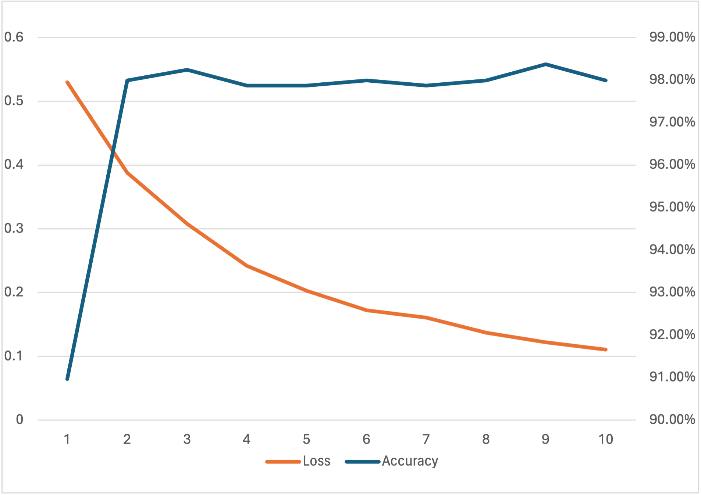

# QCNN Results

optimizer: Adam

learning rate: 0.001

accuracy on test:99.49%

| epoch    | 1      | 2      | 3      | 4      | 5      | 6      | 7      | 8      | 9      | 10     |
| -------- | ------ | ------ | ------ | ------ | ------ | ------ | ------ | ------ | ------ | ------ |
| loss     | 0.5297 | 0.388  | 0.3077 | 0.2421 | 0.2028 | 0.1725 | 0.1608 | 0.1372 | 0.1219 | 0.1106 |
| accuracy | 90.97% | 97.99% | 98.24% | 97.87% | 97.87% | 97.99% | 97.87% | 97.99% | 98.37% | 97.99% |

 

