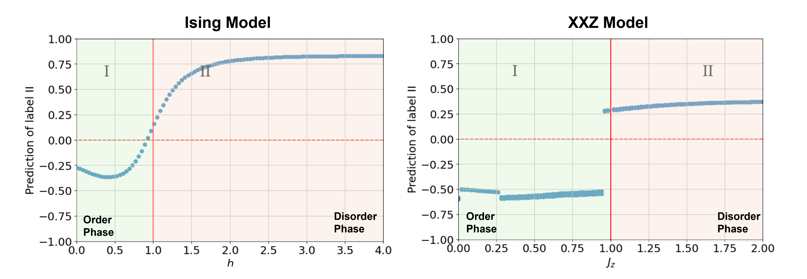

# cuPhastLearn: Fast Phase-Transition Prediction with Quantum Machine Learning and Multi-GPU Acceleration


## Overview
PhastLearn represents a significant leap in Quantum Machine Learning (QML), offering a novel framework designed for the rapid and scalable prediction of phase transitions within quantum systems. Central to PhastLearn is the innovative QCQ (Quantum-Classical-Quantum) model, which synergizes the computational power of quantum computing with cutting-edge machine-learning techniques to set new benchmarks in accuracy, speed, and scalability for QML applications.

## Objective
To develop a quantum computing technique capable of identifying phase transitions in Heisenberg spin systems. This includes studying the phase diagram and applying machine learning algorithms to label phases of the system based on the provided datasets. We also propose a quantum-classical-quantum (VQE-based) hybrid quantum algorithm for quantum phase research.


## Features
- **Quantum Circuit Implementation**: Design and implement quantum circuits to simulate spin chain systems.
- **Phase Diagram Analysis**: Analyze changes in system properties to identify phase transitions.
- **Machine Learning Integration**: Employ machine learning techniques to classify phases of spin systems.
- **Computational Speed and Scalability:** Leverages a multi-GPU framework and the PennyLane software to demonstrate significant computational acceleration, overcoming traditional bottlenecks in phase transition prediction.
- **Efficiency with cuQuantum:** Utilizes cuQuantum for VQE (Variational Quantum Eigensolver) and quantum classifier computations, showcasing notable speedups in processing times compared to CPU-based implementations.


## Installation
Clone the repository and install the required Python packages.

```bash
git clone https://github.com/Louisanity/cuPhastLearn.git
cd cuPhastLearn
pip install -r requirements.txt
```

## Usage
### VQE for Data Preparation (Test Code)
For testing our vqe algorithm for data preparation, you can simply run:

For CPU:
```bash
python vqe_preparation_cpu_test.py
```

For GPU (please make sure you follow [this instruction](https://pypi.org/project/PennyLane-Lightning-GPU/) to set up env correctly):
```bash
python vqe_preparation_gpu_test.py
```

### VQE for Data Preparation (Customized Function)
To use the script, execute it from the command line with the required arguments. Here's how:
```bash
python vqe_preparation.py --n_qubits <number_of_qubits> --depth <circuit_depth> --cuda <True/False>
```

Parameters:
--n_qubits: Specifies the number of qubits in the quantum circuit. Must be an integer.
--depth: Defines the depth of the quantum circuit. Must be an integer.
--cuda: A boolean flag (True/False) indicating whether to use a CUDA-enabled device for computation. Default is False.

Example:
To run a simulation with 10 qubits, a circuit depth of 4, without CUDA acceleration (make sure you have installed cuQuantum and Pennylane.lightning):
```bash
python vqe_preparation.py --n_qubits 10 --depth 4 --cuda False
```

The script outputs a CSV file (there is an example in our dataset folder) named with the current date and time, containing the optimized parameters, Hamiltonian parameters, energy values, and state labels generated during the simulation. This file can be used for further analysis or visualization of VQE performance. It may take time to run this code, so nice to run this code with acceleration. Then you can run our VQE-QCNN in the demo notebook.

## Result
### Phase Transition with Different Model
The PhastLearn framework showcases exceptional predictive accuracy in determining quantum phase transitions, as demonstrated by the sigmoidal response curve at critical points in both the transverse field Ising model and the XXZ model. The results, visualized in the provided graphs, reveal the model's capability to distinguish between ordered and disordered phases with a high degree of confidence. This robust classification performance, alongside our framework's computational efficiency and scalability, marks a significant advancement in the field of Quantum Machine Learning.



### VQE-CQNN


### Benchmarking with cuQuantum


Here is the benchmarking of the linearity performance with multi-GPU


## Future Work
Future development aims to enhance the QCQ architecture by harnessing the [CUDA Quantum](https://ieeexplore.ieee.org/abstract/document/10247886).
platform as quantum simulators, delivering substantial speedup and flexibility for quantum-classical computing workflows through distributed quantum simulation and seamless integration with machine learning frameworks.

## License
This project is licensed under the MIT License - see the LICENSE file for details.

## Acknowledgments
This research work was conducted with the support of QHack 2024, an event graciously backed by Xanadu, NVIDIA, Amazon, and Denver. We extend our heartfelt gratitude to Andreas Hehn, Tobi Odufeso, and Tom Lubowe for their invaluable assistance and insights, which have been pivotal to the success of this project. Their expertise and guidance have greatly contributed to the advancements presented herein. We also acknowledge NVIDIA and Denver's support with four A100 HPC units to test our algorithm. Additionally, Amazon supported us by powering up with cloud server services.

## Resources

For pennylane-lightning-gpu plugin setup, please see this instruction:
[PennyLane-Lightning-GPU](https://pypi.org/project/PennyLane-Lightning-GPU/)


Reference:
- [PennyLane's QML Data](https://docs.pennylane.ai/en/stable/code/qml_data.html)
- [Ising Model - Wikipedia](https://en.wikipedia.org/wiki/Ising_model)
- [Phase Transition - Wikipedia](https://en.wikipedia.org/wiki/Phase_transition)
- [PennyLane Tutorial on Ising Model](https://pennylane.ai/qml/demos/tutorial_isingmodel_PyTorch/)
- [PennyLane Datasets](https://pennylane.ai/datasets/qspin/transverse-field-ising-model)
- [PennyLane Lightening Plug-in](https://docs.pennylane.ai/projects/lightning/en/stable/index.html)
- [cuQuantum SDK](https://developer.nvidia.com/cuquantum-sdk)

## Contact
For more information, reach out to us at:
- **Project Link**: [https://github.com/Louisanity/cuPhastLearn](https://github.com/Louisanity/cuPhastLearn)

## How to cite

If you used this package or framework for your research, please cite:

```text
@article{chen2024quantum,
  title={Multi-GPU-Enabled Hybrid Quantum-Classical Workflow in Quantum-HPC Middleware: Applications in Quantum Simulations},
  author={Chen, Kuan-Cheng and Li, Xiaoren and Xu, Xiaotian and Wang, Yun-Yuan and Liu, Chen-Yu},
  journal={arXiv preprint arXiv:2403.05828},
  year={2024}
}
```


