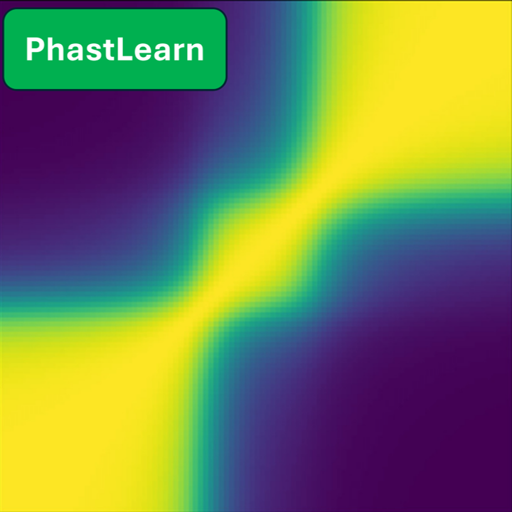

# cuPhastLearn: Fast Phase-Transition Prediction with Quantum Machine Learning with Multi-GPU Acceleration



## Overview
PhastLearn represents a significant leap in Quantum Machine Learning (QML), offering a novel framework designed for the rapid and scalable prediction of phase transitions within quantum systems. Central to PhastLearn is the innovative CQC (Classical-Quantum-Classical) model, which synergizes the computational power of quantum computing with cutting-edge machine learning techniques to set new benchmarks in accuracy, speed, and scalability for QML applications.

## Objective
To develop a quantum computing technique capable of identifying phase transitions in Heisenberg spin systems. This includes studying the phase diagram and applying machine learning algorithms to label phases of the system based on the provided datasets. We also propose a quantum-classical-quantum (VQE-based) hybrid quantum algorithm for quantum phase research.


## Features
- **Quantum Circuit Implementation**: Design and implement quantum circuits to simulate Heisenberg spin systems.
- **Phase Diagram Analysis**: Analyze changes in system properties to identify phase transitions.
- **Machine Learning Integration**: Employ machine learning techniques to classify phases of spin systems.
- **Computational Speed and Scalability:** Leverages a multi-GPU framework and the PennyLane software to demonstrate significant computational acceleration, overcoming traditional bottlenecks in phase transition prediction.
- **Efficiency with cuQuantum:** Utilizes cuQuantum for VQE (Variational Quantum Eigensolver) and quantum classifier computations, showcasing notable speedups in processing times compared to CPU-based implementations.


## Installation
Clone the repository and install the required Python packages.

```bash
git clone https://github.com/Louisanity/cuPhastLearn.git
cd cuPhastLearn
pip install -r requirements.txt
```

## Usage
### VQE for Data Preparation (Customized Function)
To use the script, execute it from the command line with the required arguments. Here's how:
```bash
python vqe_data_preparation.py --n_qubits <number_of_qubits> --depth <circuit_depth> --cuda <True/False>
```

Parameters:
--n_qubits: Specifies the number of qubits in the quantum circuit. Must be an integer.
--depth: Defines the depth of the quantum circuit. Must be an integer.
--cuda: A boolean flag (True/False) indicating whether to use a CUDA-enabled device for computation. Default is False.

Example:
To run a simulation with 10 qubits, a circuit depth of 4, without CUDA acceleration (make sure you have installed cuQuantum and Pennylane.lightning):
```bash
python vqe_data_preparation.py --n_qubits 10 --depth 4 --cuda False
```

The script outputs a CSV file (~few tens MB) named with the current date and time, containing the optimized parameters, Hamiltonian parameters, energy values, and state labels generated during the simulation. This file can be used for further analysis or visualization of VQE performance. It may take time to run this code, so nice to run this code with acceleration.

## License
This project is licensed under the MIT License - see the LICENSE file for details.

## Acknowledgments
- Utilization of datasets and resources from PennyLane and cuQUantum on Heisenberg models and phase transitions.

## Resources
- [PennyLane's QML Data](https://docs.pennylane.ai/en/stable/code/qml_data.html)
- [Ising Model - Wikipedia](https://en.wikipedia.org/wiki/Ising_model)
- [Phase Transition - Wikipedia](https://en.wikipedia.org/wiki/Phase_transition)
- [PennyLane Tutorial on Ising Model](https://pennylane.ai/qml/demos/tutorial_isingmodel_PyTorch/)
- [PennyLane Datasets](https://pennylane.ai/datasets/qspin/transverse-field-ising-model)

## Contact
For more information, reach out to us at:
- **Project Link**: [https://github.com/YourGitHubRepo/QuantumPhaseIdentifier](https://github.com/Louisanity/QuantumPhastLearning)


